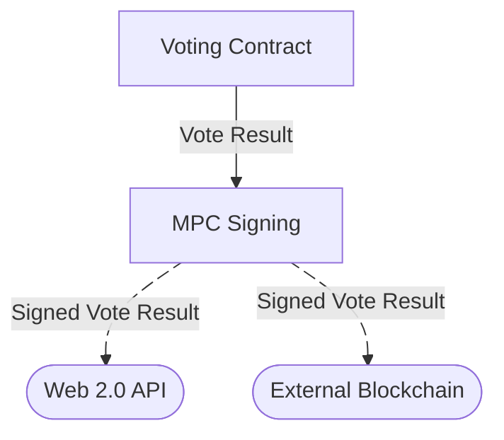

# Off-Chain MPC signing

Smart contract for creating ECDSA signatures over the secp256k1 curve in MPC where no single party knows the signing
key.

The signing key is generated in MPC once the contract is deployed and the corresponding public key is uploaded to the
contract.

A user can call the action `sign_message` on the contract with a message they wish to be signed. The assigned engines
will then perform an MPC protocol resulting in the signature of the message being placed in the state of the contract.

This contract works with three nodes and is secure as long as at most one node is malicious.

## Usage

1. [Run 3 execution
   engines](https://partisiablockchain.gitlab.io/documentation/node-operations/run-an-execution-engine.html)
2. [Compile and deploy the
   contract](https://partisiablockchain.gitlab.io/documentation/smart-contracts/compile-and-deploy-contracts.html).
3. Specify the engine addresses, and configure the preprocessing stage. Higher
   values in the preprocessing config results in a slower upstart, but higher
   signing throughput.
4. The contracts and engines will automatically begin key-generation, once
   deployed. Wait until three `upload pub key share` actions has been made by
   the engines, which indicate the completion of the public key creation. The
   generated public key is available at the state path:
   `signing_computation_state > public_key`.
5. Thereafter the contract automatically begins pre-processing. Wait until
   three `mul check two report` actions has been made, which indicates the
   completion of the pre-processing stage. Used and created pre-processing
   materials can be monitored at the state path:
   `signing_computation_state > preprocess_state`.
6. You can now make `sign message` interactions. After making such an
   interaction wait until three `sign report` actions has been made, which
   indicates the completion of a signature. The resulting signature will be
   present in the state at the state path:
   `signing_computation_state > signing_information > map > [id] > signature`

## Design

The MPC protocol can be split into three phases

1. Setup
2. Preprocessing
3. Signing

### Setup (Key Generation)

The goal of the setup phase is for the engines to exchange keys with each other, and to generate the signing key secret
shares.

To achieve this, the engines first create an ephemeral secret key, and uploads the corresponding public key to the
contract. Each engine then performs an elliptic curve Diffie-Hellman exchange with each other engine to generate seeds
for Pseudo Random Generators (PRG). These PRGs are then used to generate the signing key share.

Finally, each engine computes the public key share from their signing key share and uploads it to the contract, where it
is opened and placed in the state.

The setup phase can be completed by having each engine send two transactions.

### Preprocessing

To make signing be able to run faster the contract and engines can do some preprocessing and store the results until a
signing request is made.

Multiple preprocessed values can be created at once which saves on the number of rounds of
communication that is required between the engines.

The contract is customizable for the amount of preprocessed material the contract should have ready for signing
as well as the batch size of the preprocessing.

Each preprocessing run can be completed by having each node send four transactions.

### Signing

Finally, once a signing request has been made a preprocessed value is used to create the signature.

Only two engines are required to create signature, but only if the preprocessed material has already been created.
If the signature is unable to be created with only two engines (because one of the engines behaved maliciously), the
contract waits until the third engine has responded, at which point the signature is guaranteed to be created.

Each signing request can be completed by having each engine send a single transaction.

#### Authentication

The signing request invocation uses a basic authentication system, where only
accounts that have been configured during initialization may request
a signature on a message. This prevents anybody from requesting signatures.

## Secret sharing scheme

The secret sharing scheme of the contract is the 1-out-of-3 Replicated Secret-Sharing Scheme.

In this scheme a secret sharing [x] is defined as the three values (x3, x2), (x1, x3), and (x2, x1) where
x = x1 + x2 + x3.

I.e. each share is replicated between two parties in such a way that no single party knows all the shares, but any two
nodes can reconstruct the share.

## Security Guarantees

The security guarantees can be described based on whether confidentiality (of
the secret key), integrity (of the produced signatures) and availability (of
the operations) is preserved if a given number of nodes has been compromised.

**Confidentiality/Integrity**: At most 1/3 nodes may be malicious.

**Availability** depends upon the operation:

- Key generation: 0/3 nodes
- Preprocessing: 0/3 nodes
- Signing: 1/3 nodes

In other words: If precisely 1 node is malicious (or non-functional) they may
prevent the contract from performing the setup and preprocessing operations.
This malicious node cannot compromise the secret key, it cannot produce
counterfeit signatures, and it cannot prevent the signing operation from
running. All preprocessing steps are validated, such that attempts by a single
node to manipulate the preprocessing results ends in failure.

The security guarantees break down completely if 2 or more nodes are
malicious.

## Example use case: Decentralized Autonomous Organization

An interesting use case for MPC signing is as an signing system for
a Decentralized Autonomous Organization (DAO) that wants to transfer their
decisions to external systems, such as an Web 2.0 API or a different
blockchain. In this case the DAO can establish a contract constellation such
as:

Signed vote results can be validated by these external systems, simply by
knowing the public key of the MPC signing contract (which acts as the public
key of the DAO), and without having to know anything about the originating
blockchain or smart contract.
