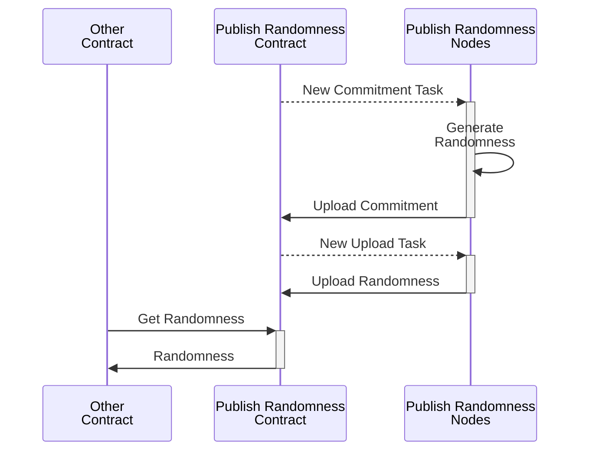

# Off-Chain Publish Randomness

Example contract for generating and publishing randomness on-chain.

This contract demonstrates how to:

- Generate randomn data in an off-chain component.
- Securely upload data from an off-chain component to the on-chain
  smart-contract, by forcing off-chain components to commit to their values,
  because uploading.
- Orchestrate complex off-chain computations by using task queues.

## Design

The contract uses randomness from off-chain components to produce randomness
on-chain. Each component generates some byte-sequences of random values and
sends it to the contract, which combines all inputs to produce a final piece of
random data, which is public on-chain, and can be consumed by a different
contract.

The tasks that off-chain components must perform are orchestrated using a task
queue, which ensures that all engines correctly perform their actions before
the contract progresses to the next task.

The contract protects against manipulation by a two-phase mechanism: First all
engines sends commitments for the values they will upload, and once all
commitments are ready, they send the actual values.

The contract aims to always have a single piece of publically available random
data in the state. All randomness is published in the smart contract itself,
which allows anybody to view the randomness. This might be undesirable for
certain applications, but this issue can be fixed. Other contracts can request
and consume the randomness, which will result in the creation of new
randomness.

See the following sequence diagram for the contract flow:

## Threat model

At least one engine is honest and sends a produces truly random byte-sequence.
This is enough for the finalized randomness to be truly random, even if all
other engines are malicous and collude.

## Extensions

The contract is explicitly simple, and publishes all randomness on-chain before
another contract can use it, which limits confidentiality. The contract can be
modified to provide improved confidentiality for the generated randomness.

Such extensions include:

- Permissioned Off-chain HTTP endpoint allowing users access to the randomness,
  without publishing it on-chain.
- Alternative flow that allows contracts to commission the randomness. This is
  especially important for on-chain smart-contracts that should prevent users
  from anticipating the randomness.
